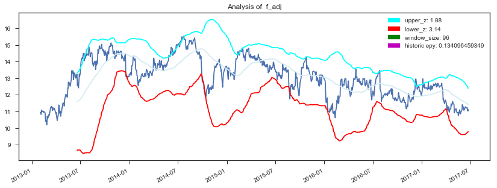
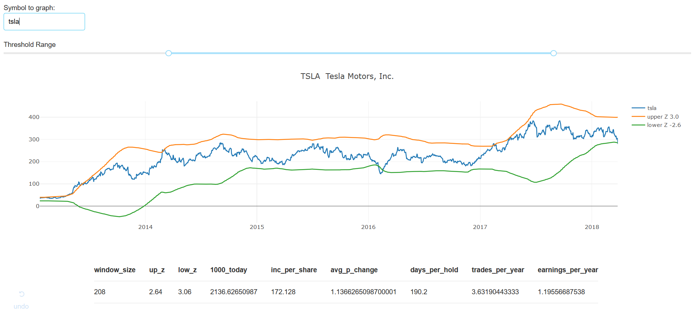

# Probabilistic Stock Analysis 

"Man is a deterministic device in a probabilistic universe" - Amos Tversky & Danny Kahneman 

This experiment is based on an idea which the two aforementioned Israeli psychologists researched: that while the human mind can solve incredibly complex problems, like vision, it is systematically erred when forced to make probabilistic judgements. Like investing. 

Our minds are particularly susceptible to warping current decisions based on the availability of recent events (availibility heuristic). For example, if a company puts out a good earnings report for their previous quarter, everyone rushes to invest. But most of those same people will tell you that the past behavior of a stock tells you nothing about its future. But my line if thinking is more that a stock is a random variable. It always reverts towards the mean when it is under or overvalued. The trick is knowing when that signal occurs. 

## Z-Score Trading Thresholds 

The basic idea here is to assume that a stock's price over a given time interval can be modeled by a normal distribution. When the stock deviates by X-standard deviations from the mean, the stock is over or undervalued. Z-scores are these trade execution thresholds. 

The z-score is a useful statistic which indicates how many standard deviations an element is from the mean.  It can be calculated from the following formula:

Z = (X - μ)/σ

Where z is the z-score, X is the value of the element, μ is the population mean, and σ is the standard deviation. The z-score allows us to calulate the probability of the value X occuring in an normal distribution. If we have a Z-score of 2, that means we constrain the normal distribution by 2 standard deviations, and 95.4% of the data falls within those constraints. There is only a 4.6% chance that data will fall outside of those bounds.

By setting upper and lower z-score bounds over the rolling mean of a stock, we can create trading singals that are triggered when the true stocks crosses over. Below you can see an example with Ford stock. A buy signal would be when the true price (dark blue) crosses under the red (lower z-bound), signalling undervaluation. The stock will revert to the mean, or get overvalued when it passes the upper blue bound, and be a sell signal. 

**NOTE** I am in no way recommend you to buy or sell any stocks. This is more of a thought exercise and may provide an interesting way to view markets. If you really want to make use of statistics, buy an index... 

## App 

I have performed an [exploratory analysis of stock data and tested the z-score idea.](z-score_analysis.ipynb) The results look promising enough to continue developing the idea. 

`/app` contains a [dash app](https://dash.plot.ly/) for visualization and exploration of the Z-score technique. It pulls new stock data with [pandas datareader](https://pandas-datareader.readthedocs.io/en/latest/), performs the relevant operations to the data, and outputs a nice chart and table of values. These values are precomputed in the z-score analysis, and pulled into the app via .csv. 

Dash is pretty interative and flexible, and allows additional components to be added in quite easily with some Python and React code. Hoping to learn more and continue building this out. 

#### Usage:  
- `pip install requirements.txt`
- `cd app`
- `python app.py` -> navigate to `http://127.0.0.1:8050/`
- type in a valid stock ticker 

#### Dependencies: 
**app**
- pandas 
- [pandas datareader](https://pandas-datareader.readthedocs.io/en/latest/)
- [dash](https://dash.plot.ly/)

**analysis**
- pandas 
- numpy 
- quandl 
- sklearn 

## Other Progress 

In addition to the exploratory analysis, I did some k-means clustering analysis on the thresholds, and built a script to scrape quandl. No real trend was found with the clustering. I also played around with building a random stock price generator to create a large, realistic dataset for validation and testing. The advantage here is that we have labels for the volatility and mean drift of the stock, which will allow supervised learning later on. This also creates an unlimited amount of testing data. 

## Future Direction

I plan to continue work in a few different directions: 

1) Continue making the visualization more awesome. 

2) Write a script to crunch some numbers and give a list of all buy/sell stocks of the day, week, month etc. Intgrate this with the dash app, as well as Google News for additional information. 

3) Work with Quantopian's open-sourced tools [Zipline](https://github.com/quantopian/zipline) and [Alphalens](https://github.com/quantopian/alphalens) to validate and quanitfy the model perfomance. 

### References and Further Reading 

[Quantopian Lectures](https://www.quantopian.com/lectures)